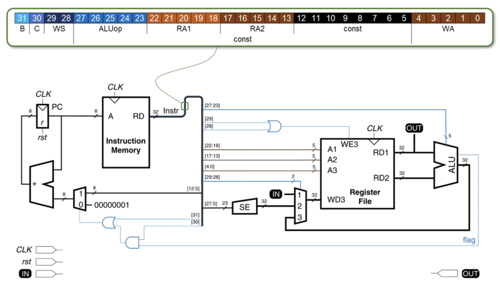

# RISC-V Single cycle mini processor

## Microarchitecture:


## Factorial program realisation:

```
PC     B C WS ALUop  RA1   RA2   const    WA
       ---------------------------------------
0)     0 0 01 00000 00000 00000 00000000 00010 // Записываем SW на второй адрес рег. файла. RG_2 = SW
1)     0 0 10 00000 00000 00000 00000001 00001 // Записываем единичную константу u = 1 на первый адрес рег.файла RG_1 = 1 [u]
2)     0 0 10 00000 00000 00000 00000001 00011 // Записываем инкремент i=1 на третий адрес рег. файла. RG_3 = 1 [i]
3)     0 0 10 00000 00000 00000 00000001 00100 // Записываем значение факториала n=1 на четевртый адрес рег. файла. RG_4 = 1 [n]

       #DO_1
4)     0 0 11 00000 00011 00001 00000000 00011 // i = i + u
5)     0 0 10 00000 00000 00000 00000001 00101 // Записываем второй инкремент j = 1 на пятый адрес рег.файла RG_5 = 1 [j]
6)     0 0 11 00000 00000 00100 00000000 00110 // Копируем n в переменную произведения p на шестой адрес. RG_6 = n [p]

       #IF
7)     0 1 00 01000 00010 00011 00000101 00000 // Сравниваем i > SW, если это так, то #EXIT (выходим из программы, PC = PC + const)

       #ELSE
            #DO_2
8)     0 0 11 00000 00100 00110 00000000 00100 // n = n + p
9)     0 0 11 00000 00101 00001 00000000 00101 // j = j + u

            #IF
10)    0 1 00 01100 00011 00101 11111010 00000 // Если i == j, то #DO_1
            #ELSE 
11)    1 0 00 00000 00000 00000 11111101 00000 // Иначе #DO_2

       #EXIT
12)    1 0 11 00000 00100 00000 00000000 00100 //Вывод на OUT значенич N
```
